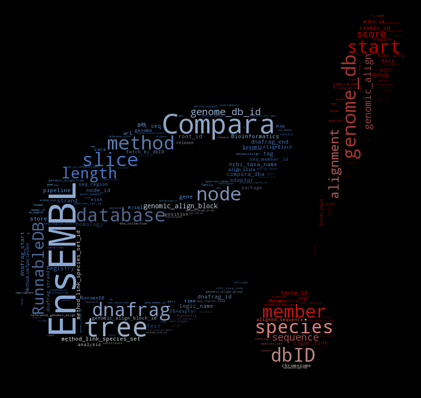

# Ensembl Compara API

The Ensembl Compara API (Application Programme Interface) serves as a
middle layer between the underlying MySQL database and the user's script.
It aims to encapsulate the database layout by providing high level access
to the database.

Find more information (including the installation guide and a tutorial) on
the Ensembl website: http://www.ensembl.org/info/docs/api/compara/

See [the main Ensembl repository](https://github.com/Ensembl/ensembl/blob/HEAD/CONTRIBUTING.md)
for the guidelines on user contributions.

Additional documentation regarding our internal procedures are temporarily available on [Read The Docs](http://ensembl-compara.readthedocs.io/en/master/)

# Installation

## Perl modules

We use a number of Perl modules that are all available on CPAN. We recommend using cpanminus to install these.
You will need both the [Core API
dependencies](https://github.com/Ensembl/ensembl/blob/HEAD/cpanfile) and
[ours](cpanfile).

## HAL alignments and progressiveCactus

If working with HAL files, additional setup is required. First, install progressiveCactus:

	git clone https://github.com/glennhickey/progressiveCactus.git
	cd progressiveCactus
	git pull
	git submodule update --init
	make
	pwd  # Prints the installation path

Note that depending on your build environment, you may have to do this as
well

        # Seems to be required on Ubuntu installations
        sudo apt-get install python-dev
        sudo ln -s /usr/lib/python2.7/plat-*/_sysconfigdata_nd.py /usr/lib/python2.7/
        # Seems to be required under linuxbrew installations
        cd progressiveCactus/submodules/sonLib
        # edit include.mk and add " -fPIC" at the end of the cflags_opt line (line 27) and make

Now, we need to set up the Compara API:

	cd ensembl-compara/xs/HALXS
	perl Makefile.PL path/to/cactus
	make

Alignments using the _method_ `CACTUS_HAL` or `CACTUS_HAL_PW` require extra
files to be downloaded from
(ftp://ftp.ensembl.org/pub/data_files/multi/hal_files/) in order to be fetched with the
API. The files must have the same name as on the FTP and must be placed
under `multi/hal_files/` within your directory of choice.
Finally, you need to define the environment variable `COMPARA_HAL_DIR` to
the latter.

For production, you should define the `PROGRESSIVE_CACTUS_DIR` environment
variable to the location of progressiveCactus.

# Contact us

Please email comments or questions to the public Ensembl developers list at
http://lists.ensembl.org/mailman/listinfo/dev

Questions may also be sent to the Ensembl help desk at
http://www.ensembl.org/Help/Contact

